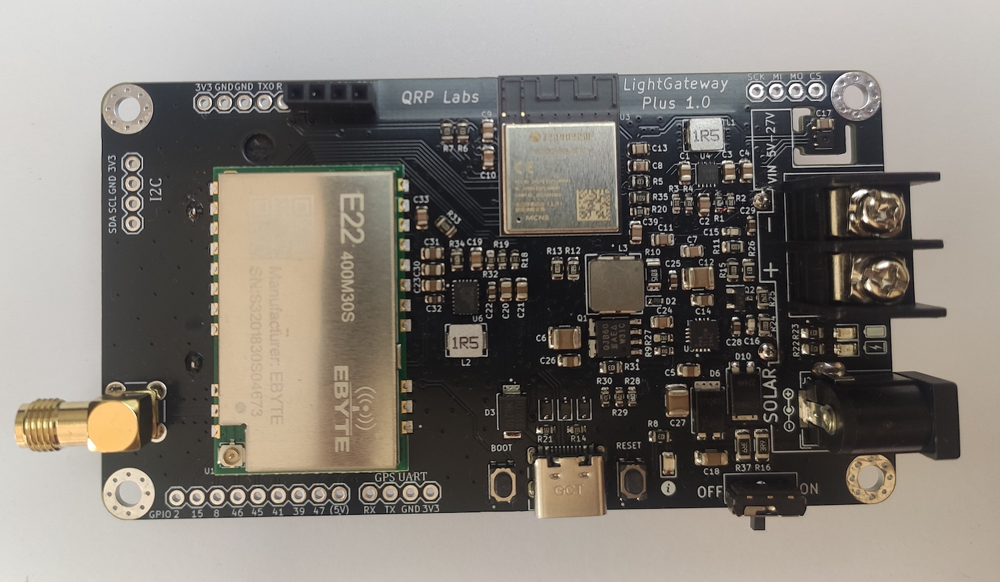
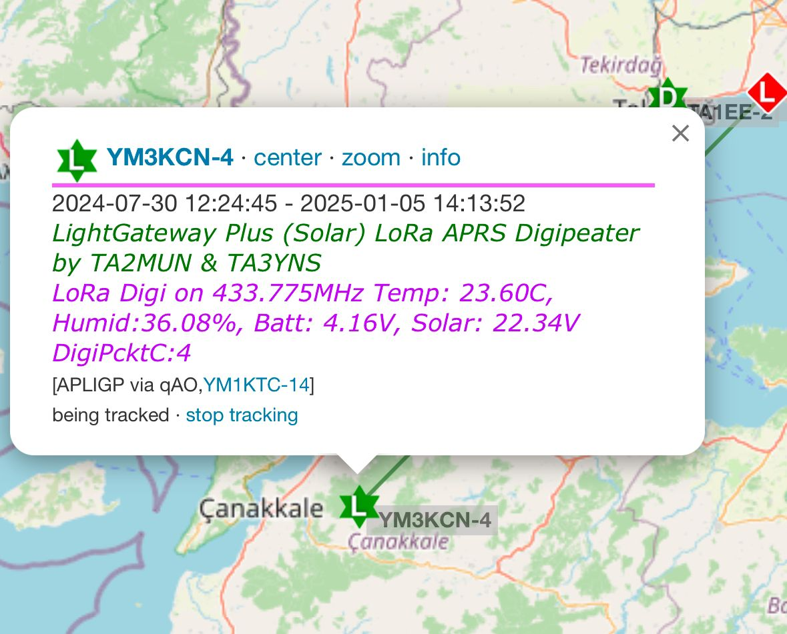
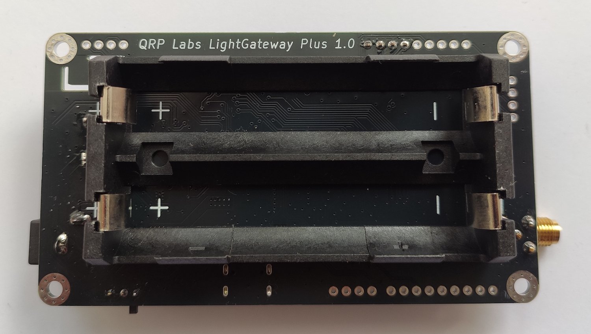

# LightGateway Plus (Solar)

LightGateway Plus (Solar) is an ESP32-based development board featuring a SX1268 (433MHz) LoRa module and 2 dBi 433 MHz SMA antenna.

LightGateway Plus (Solar) will be available on [https://shop.qrp-labs.com/aprs/](https://shop.qrp-labs.com/aprs/) soon for order.

**Important :** LightGateway Plus 1.0 operates on the amateur 70 cm (UHF) radio band with a 30 dBm output power, which typically requires an amateur radio license to operate in many countries. Therefore, if you are not a licensed HAM operator, please ensure to check local regulations and laws before purchasing the module.

## Key Benefits

- MPPT Solar Charge Controller
- SX1268 (30 dBm) LoRa Radio Module
- 2 dBi 433 MHz SMA Antenna (included) 
- Suitable for Open Source HAM Radio ESP32 projects like Meshtastic, TinyGS, LoRa APRS iGate & Digipeater, etc
- Shipped with preloaded basic [LoRa APRS Software](https://github.com/lightaprs/LightLoRaAPRS/)(iGate or Digipeater)

- Compatible with 0.96 inch OLED Screen (VCC,GND,SCL,SDA) support (OLED screen not included)
- Battery holder for two Li-Ion batteries (Batteries not included)

## Basic Features

- **Software** : Open Source
- **Weight** : 55 grams
- **Dimensions** : 99.9 mm x 55.2 mm x 26 mm
- **IDE** : Arduino & VSCode
- **Platform** : ESP32
- **CPU** : ESP32-S3 MINI
- **Flash** : 8 MB
- **Ram** : 512 kB SRAM
- **Operating Frequency** : 240 Mhz (Max)
- **Operating Voltage** : 3.3 Volt
- **Solar MPPT Input Voltage** : 5 Volt - 28 Volt via BarrelJack and Barrier Terminal
- **Input Voltage** : 3.3 (min) - 5.5 (max) Volt via Battery Holder, 5 (min) - 5.5 (max) Volt  via USB Type C 
- **Power Consumption (Deep Sleep)** : ~0.2 mA
- **Power Consumption (Idle)** : ~65 mA
- **LoRa Radio Module** : [EBYTE E22-400M30S](https://www.cdebyte.com/products/E22-400M30S) (SX1268)
- **LoRa Operating Frequency** : 410~493MHz (configurable by code)
- **LoRa Max Power** : 30dBm (configurable by code)
- **LoRa Power Consumption (TX)** : ~110 mA (22dBm)
- **Extended Pins** : I2C, I2S (in gpio pins, you can select random pins to use for I2S ), SPI, UART0, 14x GPIO Pin(includes SPI, Analog pins, Touch pins, gps uart pins), 3x Analog, 2x TOUCH, 2x CLK_OUT(in uart0 pins)

## Support

If you have any questions or need support, please contact support@lightaprs.com

## Wiki

* **[F.A.Q.](https://github.com/lightaprs/LightGatewayPlus-1.0/wiki/F.A.Q.)**
